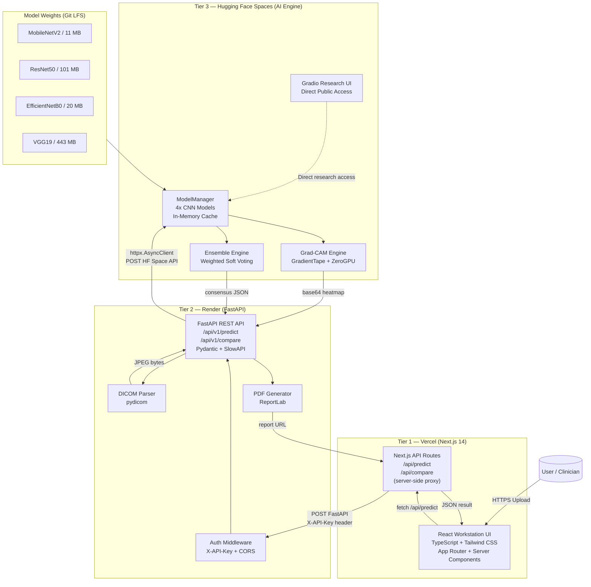

# Architecture Document — 3-Tier Decoupled Deployment
## Pneumonia Diagnostic Hub: Vercel (Next.js) + Render (FastAPI) + Hugging Face Spaces

---

| Field | Detail |
| :--- | :--- |
| **Document ID** | ARCH-PDH-3TIER-v1.1 |
| **Version** | 1.1 |
| **Status** | Final |
| **Author** | Shahab Khan |
| **Date** | August 27, 2026 |
| **Architecture Pattern** | 3-Tier Decoupled (Presentation / Application / AI Inference) |
| **Change from v1.0** | Frontend upgraded to Next.js 14 (App Router); Backend migrated from Flask to FastAPI |

---

## 1. Architecture Overview

### 1.1 Why a 3-Tier Split?

The original monolithic Flask deployment on a single host faced a critical constraint: the 4 TensorFlow CNN model files total approximately **575 MB** on disk and require **2–4 GB RAM** at runtime. Free-tier hosting platforms such as Render (512 MB RAM limit) are incapable of loading even a single model, making monolithic deployment on free infrastructure impossible.

The 3-Tier architecture solves this by:
1. **Separating AI inference** onto Hugging Face Spaces, which provides up to **16 GB RAM and ZeroGPU** on the free tier.
2. **Moving orchestration logic** to Render's free tier, which handles lightweight request routing, DICOM preprocessing, PDF generation, and authentication — none of which require large model weights in memory.
3. **Serving the frontend** on Vercel's global CDN for zero-cost, zero-configuration static hosting with automatic HTTPS.

### 1.2 High-Level Architecture Diagram

```
 ┌──────────────────────────────────────────────────────────────────────────────────┐
 │                              PUBLIC INTERNET                                     │
 └──────────────────────────────────────────────────────────────────────────────────┘
                │                        │                         │
                │ HTTPS                  │ HTTPS                   │ HTTPS
                ▼                        ▼                         ▼
 ┌─────────────────────┐    ┌────────────────────┐    ┌─────────────────────────────┐
 │                     │    │                    │    │                             │
 │   TIER 1: FRONTEND  │    │  TIER 2: BACKEND   │    │  TIER 3: AI INFERENCE ENGINE│
 │                     │    │                    │    │                             │
 │  Vercel (CDN)       │───>│  Render            │───>│  Hugging Face Spaces        │
 │  Next.js 14         │    │  FastAPI + Uvicorn │    │  Gradio / FastAPI           │
 │  React + TypeScript │    │  Python 3.11       │    │  TensorFlow 2.x             │
 │  App Router / RSC   │    │  512 MB RAM        │    │  16 GB RAM + ZeroGPU        │
 └─────────────────────┘    └────────────────────┘    └─────────────────────────────┘
         │                           │                              │
         │   User uploads CXR        │   Forwards image bytes       │   Runs inference
         │   Receives results        │   Receives JSON result       │   Returns probabilities
         │   Downloads PDF           │   Generates PDF report       │   + Grad-CAM base64
```

### 1.3 Tier Responsibilities Summary

| Responsibility | Tier 1: Vercel (Next.js) | Tier 2: Render (FastAPI) | Tier 3: Hugging Face |
| :--- | :---: | :---: | :---: |
| Serve HTML/CSS/JS to user | YES (SSR + Static) | | |
| Handle user file uploads | YES (browser) | YES (receive) | |
| Validate & sanitize files | YES (Zod schema) | YES (Pydantic) | |
| Parse DICOM files | | YES | |
| Image preprocessing | | YES (basic) | YES (full pipeline) |
| CNN Model inference | | | YES |
| Grad-CAM XAI generation | | | YES |
| PDF report generation | | YES | |
| Sample radiograph library | | YES | |
| CORS & rate limiting | | YES | YES |
| Static asset serving | YES | | |

---

## 2. Tier 1 — Frontend (Vercel)

### 2.1 Technology Stack

| Component | Technology |
| :--- | :--- |
| **Hosting** | Vercel (free Hobby tier) |
| **Framework** | Next.js 14 (App Router) |
| **Language** | TypeScript |
| **Styling** | Tailwind CSS v3 + CSS Modules |
| **State Management** | React `useState` + `useReducer` + React Query (TanStack) |
| **HTTP Client** | Axios / native `fetch` with Next.js Server Actions |
| **Build** | Next.js static + SSR hybrid export |
| **SSL** | Automatic via Vercel (Let's Encrypt) |
| **Domain** | `pneumonia-hub.vercel.app` (custom domain optional) |
| **CI/CD** | Auto-deploy on `git push` to `main` branch via Vercel GitHub integration |
| **Node Version** | 20.x LTS |

### 2.2 Responsibilities
- Render the AI Radiology Workstation UI using React Server Components (RSC) + Client Components.
- Accept patient CXR file selection (including DICOM `.dcm` files) via drag-and-drop or file browser.
- Collect patient demographic metadata (Patient ID, Age, Gender, Clinical History, Referring Physician) with Zod client-side validation.
- Submit files to the **Next.js API Route** (`/api/proxy`) which forwards to the Render FastAPI backend — keeping the backend URL server-side only.
- Display inference results: verdict badge, confidence gauge, probability bar charts, Grad-CAM images.
- Trigger PDF report download by following the report URL returned in the JSON response.

### 2.3 Directory Structure

```
frontend/
├── package.json                # Node.js dependencies
├── next.config.ts              # Next.js configuration with API rewrites
├── tsconfig.json               # TypeScript configuration
├── tailwind.config.ts          # Tailwind CSS configuration
├── vercel.json                 # Vercel deployment configuration
│
├── app/                        # Next.js App Router
│   ├── layout.tsx              # Root layout (fonts, metadata, providers)
│   ├── page.tsx                # Home page — Workstation UI entry point
│   ├── globals.css             # Global styles
│   │
│   └── api/                    # Next.js API Routes (Server-side proxy)
│       ├── predict/
│       │   └── route.ts        # POST /api/predict → forwards to FastAPI
│       └── compare/
│           └── route.ts        # POST /api/compare → forwards to FastAPI
│
├── components/
│   ├── upload/
│   │   ├── DropZone.tsx        # Drag-and-drop CXR/DICOM file upload
│   │   └── FilePreview.tsx     # Thumbnail preview before submission
│   ├── patient/
│   │   └── PatientForm.tsx     # Demographics input panel
│   ├── model/
│   │   └── ModelSelector.tsx   # Model architecture selection cards
│   ├── results/
│   │   ├── VerdictBadge.tsx    # NORMAL/PNEUMONIA verdict display
│   │   ├── ProbabilityBars.tsx # Animated confidence bar charts
│   │   ├── GradCamViewer.tsx   # Tab-based Grad-CAM image viewer
│   │   └── EnsemblePanel.tsx   # Per-model breakdown table
│   ├── samples/
│   │   └── SampleLibrary.tsx   # Sample study grid browser
│   └── shared/
│       ├── LoadingSpinner.tsx
│       └── ErrorBanner.tsx
│
├── lib/
│   ├── api.ts                  # FastAPI client functions
│   ├── types.ts                # TypeScript interfaces (PredictResponse, etc.)
│   └── validation.ts           # Zod schemas for form validation
│
└── public/
    └── logo.svg                # Application branding
```

### 2.4 next.config.ts

```typescript
import type { NextConfig } from 'next';

const nextConfig: NextConfig = {
  async rewrites() {
    return [
      {
        source: '/backend/:path*',
        destination: `${process.env.FASTAPI_URL}/:path*`,
      },
    ];
  },
  images: {
    remotePatterns: [
      { protocol: 'https', hostname: 'pneumonia-hub-api.onrender.com' },
    ],
  },
};

export default nextConfig;
```

### 2.5 Next.js API Route — Proxy (app/api/predict/route.ts)

```typescript
import { NextRequest, NextResponse } from 'next/server';

const FASTAPI_URL = process.env.FASTAPI_URL!; // Server-side only, never sent to browser

export async function POST(request: NextRequest) {
  const formData = await request.formData();

  const response = await fetch(`${FASTAPI_URL}/api/v1/predict`, {
    method: 'POST',
    body: formData,
    headers: {
      'X-API-Key': process.env.INTERNAL_API_KEY ?? '',
    },
  });

  if (!response.ok) {
    const error = await response.json();
    return NextResponse.json(error, { status: response.status });
  }

  const result = await response.json();
  return NextResponse.json(result);
}
```

> [!TIP]
> Using a Next.js **API Route as a proxy** keeps the `FASTAPI_URL` secret server-side. The browser only ever sees `https://pneumonia-hub.vercel.app/api/predict` — the Render URL is never exposed.

### 2.6 TypeScript Type Definitions (lib/types.ts)

```typescript
export interface PredictResponse {
  success: boolean;
  scan_id: string;
  prediction: 'NORMAL' | 'PNEUMONIA';
  confidence: number;
  probabilities: { NORMAL: number; PNEUMONIA: number };
  model_id: string;
  model_name: string;
  model_parameters: string;
  inference_time_ms: number;
  has_gradcam: boolean;
  gradcam_overlay_url?: string;
  gradcam_heatmap_url?: string;
  gradcam_composite_url?: string;
  report_pdf_url?: string;
  dicom_metadata?: DicomMetadata | null;
}

export interface EnsembleResponse extends PredictResponse {
  is_ensemble: boolean;
  consensus_verdict: 'NORMAL' | 'PNEUMONIA';
  consensus_confidence: number;
  agreement_level: 'UNANIMOUS' | 'STRONG_MAJORITY' | 'SPLIT_DECISION';
  agreement_text: string;
  models_breakdown: ModelResult[];
  total_inference_time_ms: number;
}

export interface DicomMetadata {
  patient_id?: string;
  patient_name?: string;
  patient_age?: string;
  patient_sex?: string;
  study_date?: string;
  modality?: string;
}

export interface ModelResult {
  id: string;
  name: string;
  weight: number;
  prediction: 'NORMAL' | 'PNEUMONIA';
  confidence: number;
  inference_time_ms: number;
}
```

### 2.7 vercel.json Configuration

```json
{
  "headers": [
    {
      "source": "/(.*)",
      "headers": [
        { "key": "X-Content-Type-Options", "value": "nosniff" },
        { "key": "X-Frame-Options", "value": "DENY" },
        { "key": "Referrer-Policy", "value": "strict-origin-when-cross-origin" }
      ]
    }
  ]
}
```

### 2.8 Key UI Components

| Component | File | Description |
| :--- | :--- | :--- |
| **DropZone** | `components/upload/DropZone.tsx` | Drag-and-drop area accepting PNG/JPG/DICOM, shows thumbnail preview |
| **PatientForm** | `components/patient/PatientForm.tsx` | Zod-validated demographics input panel |
| **ModelSelector** | `components/model/ModelSelector.tsx` | Card-based model selector with accuracy badge and parameter count |
| **VerdictBadge** | `components/results/VerdictBadge.tsx` | Animated NORMAL/PNEUMONIA verdict with confidence percentage |
| **ProbabilityBars** | `components/results/ProbabilityBars.tsx` | CSS-animated probability bar charts |
| **GradCamViewer** | `components/results/GradCamViewer.tsx` | Tab switcher: Original | Heatmap | Composite |
| **EnsemblePanel** | `components/results/EnsemblePanel.tsx` | Per-model breakdown table with agreement chip (UNANIMOUS, etc.) |
| **SampleLibrary** | `components/samples/SampleLibrary.tsx` | Fetches sample catalog from FastAPI, renders clickable thumbnails |
| **Report Button** | Inline in `page.tsx` | Fetches PDF from `/api/v1/report/{id}` via Render backend |

---

## 3. Tier 2 — Backend (Render)

### 3.1 Technology Stack

| Component | Technology |
| :--- | :--- |
| **Hosting** | Render (free Web Service tier) |
| **Framework** | FastAPI 0.115.x |
| **Runtime** | Python 3.11 |
| **Server** | Uvicorn (1 worker, async ASGI) |
| **Data Validation** | Pydantic v2 |
| **API Docs** | Auto-generated Swagger UI at `/docs` (built into FastAPI) |
| **RAM Limit** | 512 MB |
| **CPU** | 0.1 vCPU (shared, free tier) |
| **Persistent Storage** | Render Disk (optional, 1 GB free) |
| **SSL** | Automatic via Render |
| **Domain** | `pneumonia-hub-api.onrender.com` |

> [!IMPORTANT]
> The Render backend does **NOT** load any TensorFlow model weights. All `.h5` files remain exclusively on Hugging Face. This is what keeps the Render service within 512 MB RAM.

> [!TIP]
> FastAPI's built-in async support means file I/O (DICOM parsing, PDF generation) and the outbound HTTP call to Hugging Face can be handled with `async def` + `await`, improving throughput without additional threads.

### 3.2 Responsibilities
- Receive file uploads from the Next.js frontend (via Next.js API Route proxy).
- Validate and sanitize uploaded files using **Pydantic** and custom validators.
- Detect and parse DICOM files, extract metadata, convert to JPEG for downstream processing.
- Forward the preprocessed image bytes and parameters to the Hugging Face Inference API via `httpx.AsyncClient`.
- Receive inference results (probabilities, Grad-CAM base64 data) from Hugging Face.
- Generate PDF clinical reports embedding the CXR image, Grad-CAM overlay, and structured results.
- Serve the generated PDF via a download endpoint.
- Expose the `/api/v1/samples` catalog and serve sample image files.
- Enforce CORS policy, request rate limiting, and optional API key authentication.

### 3.3 Directory Structure

```
backend/
├── main.py                 # FastAPI app factory & router registration
├── config.py               # Settings via pydantic-settings (BaseSettings)
├── requirements.txt        # Python dependencies (NO tensorflow, NO .h5 files)
│
├── routers/
│   ├── predict.py          # POST /api/v1/predict
│   ├── compare.py          # POST /api/v1/compare
│   ├── report.py           # GET  /api/v1/report/{filename}
│   ├── samples.py          # GET  /api/v1/samples
│   └── health.py           # GET  /api/v1/health
│
├── core/
│   ├── dicom_parser.py     # DICOM decoding & metadata extraction
│   ├── report_generator.py # PDF report generation (ReportLab)
│   ├── sample_manager.py   # Sample radiograph catalog & OpenCV generation
│   ├── hf_client.py        # Hugging Face Inference API async HTTP client
│   └── validator.py        # File validation utilities
│
├── schemas/
│   ├── predict.py          # Pydantic models: PredictRequest, PredictResponse
│   ├── compare.py          # Pydantic models: EnsembleResponse, ModelResult
│   └── common.py           # Shared types: DicomMetadata, ErrorResponse
│
├── static/
│   ├── samples/            # Pre-generated synthetic CXR samples
│   └── reports/            # Temporarily stored generated PDF reports
│
├── Procfile                # Render: uvicorn main:app --host 0.0.0.0 --port $PORT
├── render.yaml             # Render deployment configuration
└── .env.example            # Environment variable template
```

### 3.4 main.py (FastAPI Application Factory)

```python
from fastapi import FastAPI
from fastapi.middleware.cors import CORSMiddleware
from fastapi.staticfiles import StaticFiles
from slowapi import Limiter, _rate_limit_exceeded_handler
from slowapi.util import get_remote_address
from slowapi.errors import RateLimitExceeded

from config import get_settings
from routers import predict, compare, report, samples, health
from core.sample_manager import ensure_samples_generated

settings = get_settings()

app = FastAPI(
    title="Pneumonia Diagnostic Hub API",
    description="Multi-model CNN inference engine for chest radiograph pneumonia screening",
    version="2.3.0",
    docs_url="/docs",
    redoc_url="/redoc",
)

# CORS — allow only the Next.js frontend origin
app.add_middleware(
    CORSMiddleware,
    allow_origins=settings.cors_origins,
    allow_credentials=False,
    allow_methods=["GET", "POST"],
    allow_headers=["Content-Type", "Authorization", "X-API-Key"],
)

# Rate limiting
limiter = Limiter(key_func=get_remote_address)
app.state.limiter = limiter
app.add_exception_handler(RateLimitExceeded, _rate_limit_exceeded_handler)

# Mount static files
app.mount("/static", StaticFiles(directory="static"), name="static")

# Register routers
app.include_router(health.router, prefix="/api/v1")
app.include_router(predict.router, prefix="/api/v1")
app.include_router(compare.router, prefix="/api/v1")
app.include_router(report.router, prefix="/api/v1")
app.include_router(samples.router, prefix="/api/v1")

@app.on_event("startup")
async def startup_event():
    ensure_samples_generated()
```

### 3.5 config.py (Pydantic Settings)

```python
from functools import lru_cache
from pydantic_settings import BaseSettings
from typing import List

class Settings(BaseSettings):
    hf_space_url: str = "https://shahab-khan396-pneumonia-hub.hf.space"
    hf_api_token: str = ""
    internal_api_key: str = ""
    cors_origins: List[str] = ["https://pneumonia-hub.vercel.app"]
    max_upload_bytes: int = 33_554_432  # 32 MB
    upload_dir: str = "static/reports"

    class Config:
        env_file = ".env"

@lru_cache
def get_settings() -> Settings:
    return Settings()
```

### 3.6 Pydantic Response Schemas (schemas/predict.py)

```python
from pydantic import BaseModel
from typing import Optional, Dict

class DicomMetadata(BaseModel):
    patient_id: Optional[str] = None
    patient_name: Optional[str] = None
    patient_age: Optional[str] = None
    patient_sex: Optional[str] = None
    study_date: Optional[str] = None
    modality: Optional[str] = None

class PredictResponse(BaseModel):
    success: bool
    scan_id: str
    prediction: str                        # "NORMAL" | "PNEUMONIA"
    confidence: float
    probabilities: Dict[str, float]
    model_id: str
    model_name: str
    model_parameters: str
    inference_time_ms: float
    has_gradcam: bool
    gradcam_overlay_url: Optional[str] = None
    gradcam_heatmap_url: Optional[str] = None
    report_pdf_url: Optional[str] = None
    dicom_metadata: Optional[DicomMetadata] = None

class ErrorResponse(BaseModel):
    success: bool = False
    error: str
```

### 3.7 render.yaml Configuration

```yaml
services:
  - type: web
    name: pneumonia-hub-api
    runtime: python
    buildCommand: pip install -r requirements.txt
    startCommand: uvicorn main:app --host 0.0.0.0 --port $PORT --workers 1
    envVars:
      - key: HF_SPACE_URL
        value: https://shahab-khan396-pneumonia-hub.hf.space
      - key: HF_API_TOKEN
        sync: false
      - key: INTERNAL_API_KEY
        generateValue: true
      - key: CORS_ORIGINS
        value: "[\"https://pneumonia-hub.vercel.app\"]"
      - key: MAX_UPLOAD_BYTES
        value: "33554432"
```

### 3.8 Hugging Face Client Module (hf_client.py)

This is the key new module that replaces local model loading on the backend:

```python
import httpx
from functools import lru_cache
from config import get_settings

REQUEST_TIMEOUT = 120.0  # seconds

async def call_hf_predict(
    image_bytes: bytes,
    filename: str,
    model_choice: str,
    explain: bool = True
) -> dict:
    """
    Async: Forward image bytes to the Hugging Face Space inference endpoint.
    Returns the raw JSON inference result dict.
    """
    settings = get_settings()
    headers = {}
    if settings.hf_api_token:
        headers["Authorization"] = f"Bearer {settings.hf_api_token}"

    async with httpx.AsyncClient(timeout=REQUEST_TIMEOUT) as client:
        response = await client.post(
            f"{settings.hf_space_url}/api/v1/predict",
            files={"file": (filename, image_bytes, "image/jpeg")},
            data={
                "model_choice": model_choice,
                "explain": str(explain).lower(),
                "generate_report": "false",
            },
            headers=headers,
        )
        response.raise_for_status()
        return response.json()


async def call_hf_compare(
    image_bytes: bytes,
    filename: str,
    explain: bool = True
) -> dict:
    """
    Async: Forward image bytes to the HF ensemble comparison endpoint.
    """
    settings = get_settings()
    headers = {}
    if settings.hf_api_token:
        headers["Authorization"] = f"Bearer {settings.hf_api_token}"

    async with httpx.AsyncClient(timeout=REQUEST_TIMEOUT) as client:
        response = await client.post(
            f"{settings.hf_space_url}/api/v1/compare",
            files={"file": (filename, image_bytes, "image/jpeg")},
            data={
                "explain": str(explain).lower(),
                "generate_report": "false",
            },
            headers=headers,
        )
        response.raise_for_status()
        return response.json()
```

### 3.9 Backend requirements.txt (No TensorFlow)

```
fastapi==0.115.0
uvicorn[standard]==0.30.6
pydantic==2.9.0
pydantic-settings==2.5.0
httpx==0.27.0              # Async HTTP client for HF API calls
pydicom==2.4.4
opencv-python-headless==4.10.0.84
numpy==1.26.4
reportlab==4.2.5
slow-api==0.12.0           # Rate limiting for FastAPI
python-multipart==0.0.9    # Required for FastAPI file uploads
python-dotenv==1.0.1
```

> [!TIP]
> By removing `tensorflow` and all `.h5` model files from the backend, the Docker image drops from ~3 GB to ~350 MB. FastAPI's async I/O also allows concurrent file upload handling without blocking threads, improving responsiveness under load.

---

## 4. Tier 3 — AI Inference Engine (Hugging Face Spaces)

### 4.1 Technology Stack

| Component | Technology |
| :--- | :--- |
| **Hosting** | Hugging Face Spaces (free tier) |
| **SDK** | Gradio (managed by HF environment) |
| **Runtime** | Python 3.10 (HF container) |
| **RAM** | Up to 16 GB (free tier) |
| **GPU** | ZeroGPU (NVIDIA A10G, on-demand, via `@spaces.GPU`) |
| **Storage** | Ephemeral (no persistent disk on free tier) |
| **Domain** | `shahab-khan396-pneumonia-hub.hf.space` |
| **Model Files** | 4x `.h5` files tracked via Git LFS (~575 MB total) |

### 4.2 Responsibilities
- Load and cache all 4 CNN model weights (MobileNetV2, ResNet50, EfficientNetB0, VGG19) into memory.
- Expose the Gradio interactive demo UI at the root (`/`) for direct research use.
- Expose a Flask-compatible REST API (`/api/v1/predict`, `/api/v1/compare`) for backend-to-backend calls from Render.
- Run GPU-accelerated TensorFlow inference using `@spaces.GPU` decorator when ZeroGPU is available.
- Compute Grad-CAM heatmaps and return them as base64-encoded image data in the JSON response.
- Return inference results as structured JSON (no PDF generation — delegated to Render backend).

### 4.3 HF Space Directory Structure

```
pneumonia-hub/                  (Hugging Face Space root)
├── README.md                   # HF Space config frontmatter (sdk: gradio)
├── app.py                      # Entry point: Gradio UI + Flask API exposure
├── requirements.txt            # Python deps (NO gradio -- managed by HF)
│
├── Flask Application/
│   ├── config.py               # Model paths & configuration
│   └── core/
│       ├── model_manager.py    # @spaces.GPU-decorated inference engine
│       ├── preprocessor.py     # Image preprocessing pipeline
│       ├── gradcam.py          # Grad-CAM heatmap computation
│       ├── ensemble.py         # Weighted soft-voting consensus
│       ├── dicom_parser.py     # DICOM parsing (for direct HF uploads)
│       ├── sample_manager.py   # Sample catalog generation
│       └── validator.py        # File validation
│
├── VGG19_model.h5              # (Git LFS) 443 MB
├── resnet50_model.h5           # (Git LFS) 101 MB
├── efficientnet_model.h5       # (Git LFS) 20 MB
└── mobilenet_model.h5          # (Git LFS) 11 MB
```

### 4.4 README.md Frontmatter (HF Space Config)

```yaml
---
title: Pneumonia Diagnostic Hub
emoji: 🫁
colorFrom: blue
colorTo: purple
sdk: gradio
app_file: app.py
pinned: true
license: mit
---
```

> [!WARNING]
> Do NOT pin `sdk_version` in the frontmatter. Hugging Face manages the Gradio version in the container. Pinning a specific version causes `ImportError` mismatches between the installed Gradio package and the expected version.

### 4.5 ZeroGPU Integration

```python
import spaces

@spaces.GPU(duration=120)
def run_gpu_inference(model_id: str, image_tensor, generate_cam: bool, 
                      original_image_path, base_filename: str) -> dict:
    """
    Wrapped GPU inference call. ZeroGPU allocates an NVIDIA A10G for up to
    120 seconds per call, then releases it back to the shared pool.
    Falls back to CPU if no GPU is available.
    """
    manager = ModelManager.get_instance()
    return manager.predict(
        model_id=model_id,
        image_tensor=image_tensor,
        generate_cam=generate_cam,
        original_image_path=original_image_path,
        base_filename=base_filename
    )
```

### 4.6 HF Space requirements.txt

```
tensorflow-cpu==2.16.2
# OR: tensorflow==2.16.2 (ZeroGPU handles CUDA at runtime)
pydicom==2.4.4
opencv-python-headless==4.10.0.84
numpy==1.26.4
reportlab==4.2.5
scikit-image==0.23.2
spaces>=0.28.0             # Hugging Face ZeroGPU decorator
huggingface_hub>=0.22.0
```

---

## 5. Inter-Tier Communication Protocol

### 5.1 Tier 1 -> Tier 2 (Frontend -> Render Backend)

| Property | Value |
| :--- | :--- |
| **Protocol** | HTTPS (TLS 1.3) |
| **Method** | POST |
| **Content-Type** | `multipart/form-data` |
| **Auth** | None (public endpoint, rate-limited by IP) |
| **Max Payload** | 32 MB |
| **Timeout** | 180 seconds (browser fetch timeout) |
| **CORS** | Allowed origins: `https://pneumonia-hub.vercel.app` |

**Request fields (from browser):**
```
file:              <binary CXR or DICOM>
model_choice:      mobilenet | resnet50 | efficientnet | VGG19
explain:           true | false
generate_report:   true | false
patient_id:        <string>
patient_age:       <numeric string>
patient_gender:    Male | Female | Other
clinical_history:  <string>
referring_physician: <string>
```

### 5.2 Tier 2 -> Tier 3 (Render Backend -> Hugging Face)

| Property | Value |
| :--- | :--- |
| **Protocol** | HTTPS (TLS 1.3) |
| **Method** | POST |
| **Content-Type** | `multipart/form-data` |
| **Auth** | `Authorization: Bearer {HF_API_TOKEN}` (optional, for private spaces) |
| **Max Payload** | ~5 MB (JPEG after DICOM conversion) |
| **Timeout** | 120 seconds (httpx client timeout) |
| **Retry** | 1 retry on connection timeout |

**What the Render backend sends to Hugging Face:**
- The image as JPEG bytes (post-DICOM-conversion if applicable).
- `model_choice` and `explain` parameters.
- `generate_report: false` — PDF generation is always delegated back to Render.

**What Hugging Face returns to Render:**
```json
{
  "success": true,
  "prediction": "PNEUMONIA",
  "confidence": 94.37,
  "probabilities": { "NORMAL": 5.63, "PNEUMONIA": 94.37 },
  "model_id": "mobilenet",
  "inference_time_ms": 87.42,
  "has_gradcam": true,
  "gradcam_overlay_b64": "<base64-encoded JPEG>",
  "gradcam_heatmap_b64": "<base64-encoded JPEG>",
  "gradcam_composite_b64": "<base64-encoded JPEG>"
}
```

> [!NOTE]
> The Hugging Face Space returns Grad-CAM images as **base64-encoded strings** rather than file URLs, because HF ephemeral storage cannot guarantee URL persistence across requests. The Render backend decodes these and saves them to its local `static/reports/` directory before generating the PDF.

---

## 6. Data Flow Diagrams

### 6.1 Single-Model Inference Flow

```
[Browser]
    │
    │  1. User selects CXR file + enters demographics
    │     User clicks "Analyze"
    │
    ▼
[Vercel Frontend] --- POST /api/predict (multipart: file + form data)
    │
    │  (Vercel rewrites /api/* to Render)
    │
    ▼
[Render Backend - /api/v1/predict]
    │
    ├── 2. validate_image_file() → check extension, MIME type, size
    │
    ├── 3. If DICOM: parse_dicom_bytes() → extract metadata, convert to JPEG
    │
    ├── 4. Save image to static/uploads/ for PDF embedding
    │
    ├── 5. call_hf_predict(image_bytes, model_choice, explain=True)
    │         │
    │         │  POST https://shahab-khan396-pneumonia-hub.hf.space/api/v1/predict
    │         │
    │         ▼
    │   [HF Space - /api/v1/predict]
    │         │
    │         ├── 6. preprocess_image(image_bytes) → (1,128,128,3) tensor
    │         │
    │         ├── 7. @spaces.GPU → manager.predict(model_id, tensor)
    │         │         └── CNN forward pass → softmax probabilities
    │         │
    │         ├── 8. compute_gradcam_heatmap() → 2D heatmap array
    │         │
    │         ├── 9. create_gradcam_overlay() → 3 visualization images
    │         │
    │         └── 10. Return JSON { prediction, confidence, gradcam_*_b64 }
    │
    ├── 11. Decode base64 Grad-CAM images → save to static/reports/
    │
    ├── 12. generate_clinical_pdf_report() → report_{scan_id}.pdf
    │
    └── 13. Return JSON to browser {
                prediction, confidence, probabilities,
                gradcam_overlay_url, report_pdf_url,
                dicom_metadata (if DICOM)
           }

[Vercel Frontend]
    │
    └── 14. Render verdict badge, charts, Grad-CAM images
         PDF download button → GET /api/v1/report/report_{scan_id}.pdf
```

### 6.2 Ensemble Comparison Flow

```
[Browser]
    │  POST /api/compare
    ▼
[Render Backend - /api/v1/compare]
    │
    ├── Validate, DICOM parse (if applicable)
    │
    ├── call_hf_compare(image_bytes, explain=True)
    │         │
    │         ▼
    │   [HF Space - /api/v1/compare]
    │         │
    │         ├── For each model in [mobilenet, resnet50, efficientnet, VGG19]:
    │         │     ├── @spaces.GPU → manager.predict(model_id, tensor)
    │         │     └── (optional) compute_gradcam_heatmap()
    │         │
    │         ├── run_multi_model_comparison()
    │         │     ├── Weighted soft-voting consensus
    │         │     └── Agreement classification (UNANIMOUS / STRONG_MAJORITY / SPLIT)
    │         │
    │         └── Return { consensus_verdict, confidence, models_breakdown[] }
    │
    ├── Decode + save Grad-CAM images
    ├── generate_clinical_pdf_report() (with ensemble matrix embedded)
    └── Return final JSON to browser
```

### 6.3 DICOM Upload Flow

```
[Browser]
    │  User uploads chest.dcm
    ▼
[Render Backend]
    │
    ├── is_dicom_file(path) → checks DICM magic header @ offset 128
    │
    ├── parse_dicom_bytes(raw_bytes):
    │     ├── dcm = pydicom.dcmread(BytesIO(raw_bytes), force=True)
    │     ├── Apply Rescale Slope + Intercept
    │     ├── Apply VOI LUT windowing
    │     ├── Handle MONOCHROME1 inversion
    │     ├── Convert to uint8 PNG/JPEG
    │     └── Extract metadata dict (PatientID, Age, StudyDate, Modality, etc.)
    │
    ├── Forward JPEG bytes (not original .dcm) to HF Space
    │
    └── Include dicom_metadata in final JSON response to browser
```

---

## 7. Deployment Procedures

### 7.1 Tier 3: Deploy to Hugging Face Spaces

```bash
# Step 1: Install HF CLI
pip install huggingface_hub

# Step 2: Login with write token
huggingface-cli login --token hf_YOUR_TOKEN_HERE

# Step 3: Clone the space repository
git clone https://huggingface.co/spaces/shahab-khan396/pneumonia-hub
cd pneumonia-hub

# Step 4: Track large model files with Git LFS
git lfs install
git lfs track "*.h5"

# Step 5: Copy project files
cp -r "FastAPI Application/" .
cp main.py .
cp requirements.txt .

# Step 6: Ensure README.md has correct frontmatter
# sdk: gradio (no sdk_version pin!)

# Step 7: Push to HF
git add .
git commit -m "feat: deploy AI inference engine to HF Spaces"
git push
```

### 7.2 Tier 2: Deploy to Render (FastAPI)

```bash
# Render auto-deploys from GitHub. Connect your repo at render.com/new

# Manual deployment steps:
# 1. Push backend/ directory to a GitHub repository
# 2. Go to render.com → New → Web Service
# 3. Connect GitHub repo, set root directory to: backend/
# 4. Set Build Command:
#      pip install -r requirements.txt
# 5. Set Start Command:
#      uvicorn main:app --host 0.0.0.0 --port $PORT --workers 1
# 6. Set Environment Variables:
#    HF_SPACE_URL    = https://shahab-khan396-pneumonia-hub.hf.space
#    HF_API_TOKEN    = hf_YOUR_TOKEN
#    INTERNAL_API_KEY = (click "Generate" in Render)
#    CORS_ORIGINS    = ["https://pneumonia-hub.vercel.app"]

# FastAPI Swagger docs are auto-available at:
# https://pneumonia-hub-api.onrender.com/docs
```

### 7.3 Tier 1: Deploy to Vercel (Next.js)

```bash
# Install Vercel CLI
npm install -g vercel

# Initialize Next.js project
cd frontend/
npx create-next-app@latest . --typescript --tailwind --app --no-src-dir

# Install additional dependencies
npm install axios @tanstack/react-query zod

# Deploy to Vercel
vercel --prod

# Or connect GitHub repo at vercel.com/new
# Set root directory to: frontend/
# Framework: Next.js (auto-detected)

# Environment Variables to set in Vercel dashboard:
# FASTAPI_URL      = https://pneumonia-hub-api.onrender.com  (server-side only)
# INTERNAL_API_KEY = <same value set on Render>              (server-side only)
```

---

## 8. Environment Variable Schema

### 8.1 Render Backend Environment Variables

| Variable | Required | Default | Description |
| :--- | :---: | :--- | :--- |
| `HF_SPACE_URL` | YES | — | Full URL of the Hugging Face Space inference API |
| `HF_API_TOKEN` | NO | `""` | HF API token (required only for private Spaces) |
| `SECRET_KEY` | YES | — | Flask session secret (use Render's generateValue) |
| `FLASK_ENV` | YES | `production` | Flask environment mode |
| `MAX_CONTENT_LENGTH` | NO | `33554432` | Max upload size in bytes (32 MB) |
| `CORS_ORIGINS` | YES | — | Allowed CORS origins (Vercel domain) |
| `PORT` | NO | `10000` | Port assigned by Render automatically |
| `UPLOAD_FOLDER` | NO | `static/reports` | Directory for PDF and temp file storage |

### 8.2 Hugging Face Space Secrets

| Variable | Purpose |
| :--- | :--- |
| `HF_TOKEN` | Used by `huggingface_hub` for authenticated model operations |
| `SPACE_AUTHOR_NAME` | Auto-set by HF environment |

### 8.3 Vercel Environment Variables (Next.js Frontend)

| Variable | Required | Visibility | Description |
| :--- | :---: | :---: | :--- |
| `FASTAPI_URL` | YES | **Server-side only** | Render FastAPI base URL (never sent to browser) |
| `INTERNAL_API_KEY` | YES | **Server-side only** | Shared secret for Next.js -> FastAPI calls |

> [!IMPORTANT]
> Do **NOT** prefix these with `NEXT_PUBLIC_`. That prefix would expose the values to the client bundle. Keep them as plain env vars, accessible only in Next.js Server Components and API Routes.

---

## 9. Security Architecture

### 9.1 CORS Policy (FastAPI — Render Backend)

CORS is configured in `main.py` via `CORSMiddleware` (shown in Section 3.4). Allowed origins are loaded from the `CORS_ORIGINS` environment variable as a JSON list.

### 9.2 Rate Limiting (FastAPI — SlowAPI)

```python
from slowapi import Limiter
from slowapi.util import get_remote_address
from fastapi import Request

limiter = Limiter(key_func=get_remote_address)

# routers/predict.py
@router.post("/predict", response_model=PredictResponse)
@limiter.limit("10/minute")
async def predict_api(request: Request, file: UploadFile = File(...), ...):
    ...

# routers/compare.py
@router.post("/compare", response_model=EnsembleResponse)
@limiter.limit("5/minute")
async def compare_api(request: Request, file: UploadFile = File(...), ...):
    ...
```

### 9.3 Internal API Key Authentication

Next.js API Routes include an `X-API-Key` header when forwarding to FastAPI. FastAPI validates it via a dependency:

```python
# core/auth.py
from fastapi import Header, HTTPException, status
from config import get_settings

async def verify_internal_key(x_api_key: str = Header(...)):
    settings = get_settings()
    if settings.internal_api_key and x_api_key != settings.internal_api_key:
        raise HTTPException(
            status_code=status.HTTP_403_FORBIDDEN,
            detail="Invalid internal API key"
        )

# Usage in router:
@router.post("/predict", dependencies=[Depends(verify_internal_key)])
async def predict_api(...):
    ...
```

### 9.3 Security Headers (Render + Vercel)

| Header | Value |
| :--- | :--- |
| `X-Content-Type-Options` | `nosniff` |
| `X-Frame-Options` | `DENY` |
| `Content-Security-Policy` | `default-src 'self'; img-src 'self' data:` |
| `Strict-Transport-Security` | `max-age=31536000; includeSubDomains` |

### 9.4 Data Privacy Considerations

- No uploaded images are stored permanently on any tier. Render's `static/reports/` directory is ephemeral (purged on redeploy).
- No patient data is logged to application logs.
- DICOM metadata extracted at the Render tier is only returned in the response — never written to a database.
- HF Spaces ephemeral storage means no image data persists between requests on Tier 3.

---

## 10. Monitoring & Observability

| Tier | Monitoring Method |
| :--- | :--- |
| **Vercel** | Vercel Analytics dashboard; deployment logs in Vercel UI |
| **Render** | Render Logs dashboard; `/api/v1/health` endpoint for uptime monitors (e.g., UptimeRobot) |
| **Hugging Face** | HF Space build logs; container logs in HF Space settings |

### 10.1 Health Check Endpoints

| Endpoint | Tier | Purpose |
| :--- | :--- | :--- |
| `GET /` | Vercel | Returns 200 for Vercel liveness |
| `GET /api/v1/health` | Render | Returns system status JSON |
| `GET /` | Hugging Face | Gradio UI renders if Space is running |

### 10.2 Recommended Uptime Monitor Config

```
Monitor URL:  https://pneumonia-hub-api.onrender.com/api/v1/health
Interval:     5 minutes
Expected:     HTTP 200, body contains "healthy"
Alert:        Email on 2 consecutive failures
```

> [!NOTE]
> Render free tier services spin down after 15 minutes of inactivity. The uptime monitor ping every 5 minutes prevents cold starts, keeping the backend warm at all times.

---

## 11. Scalability Roadmap

### 11.1 Current (Free Tier)

```
Vercel Free --> Render Free (512 MB) --> HF Spaces Free (16 GB RAM, ZeroGPU)
```

### 11.2 Growth Stage (Paid Tier)

```
Vercel Pro  --> Render Starter ($7/mo, 512MB dedicated)
            --> HF Spaces Pro ($9/mo, A10G persistent GPU)
```

### 11.3 Production Scale

```
Vercel Pro  --> Render Standard ($25/mo, 2 GB RAM)
            --> HF Inference Endpoints ($0.0006/s GPU)
            --> Redis cache for inference result caching
            --> PostgreSQL for audit logging
            --> AWS S3 for persistent PDF report storage
```

---

## 12. Cost Analysis (Free Tier)

| Tier | Platform | Cost | Limits |
| :--- | :--- | :--- | :--- |
| Frontend | Vercel Hobby | $0/month | 100 GB bandwidth, unlimited deploys |
| Backend | Render Free | $0/month | 512 MB RAM, 0.1 vCPU, spins down after 15 min |
| AI Engine | HF Spaces Free | $0/month | 16 GB RAM, ZeroGPU (shared), 50 GB LFS storage |
| **Total** | | **$0/month** | Suitable for research and demonstration workloads |

> [!CAUTION]
> Hugging Face ZeroGPU is a shared pool. During high-demand periods, GPU requests may queue. CPU fallback is always available but may increase inference latency to 2–5 seconds per request.

---

## 13. Architecture Decision Log

| Decision | Rationale | Alternative Considered |
| :--- | :--- | :--- |
| Separate AI inference to HF Spaces | TF models require 2-4 GB RAM; Render free tier is 512 MB | Single VPS with 8 GB RAM ($40/mo) |
| Gradio SDK on HF, FastAPI on Render | HF manages Gradio version; FastAPI provides async I/O, Pydantic validation, and auto-generated Swagger — better fit than Flask for a pure API service | Flask (synchronous, manual schema) |
| Next.js over plain HTML | App Router enables Server Components, typed API Routes as proxy, and Vercel-native deployment with zero config | Vanilla HTML with CDN JS |
| Next.js API Route as proxy | Keeps `FASTAPI_URL` and `INTERNAL_API_KEY` server-side; browser never sees Render URL | Direct browser fetch with CORS headers |
| `INTERNAL_API_KEY` between Next.js and FastAPI | Prevents public internet from calling FastAPI directly, bypassing rate limits | IP allowlist (brittle with Vercel's dynamic edge IPs) |
| `async def` + `httpx.AsyncClient` in FastAPI | Non-blocking HF call; Uvicorn can serve other requests while waiting for HF response | Synchronous `requests` library (blocks thread) |
| Base64 for Grad-CAM transfer (HF -> Render) | HF ephemeral storage can't serve files via URL reliably | Presigned S3 URLs (adds cost and complexity) |
| PDF generation on Render, not HF | HF ephemeral storage; PDFs need persistent URL for browser download | Generate PDF on HF, return base64 |
| Git LFS for model files | Models exceed GitHub's 100 MB limit | Hugging Face model hub download at startup |

---

## 14. Mermaid Architecture Diagram


