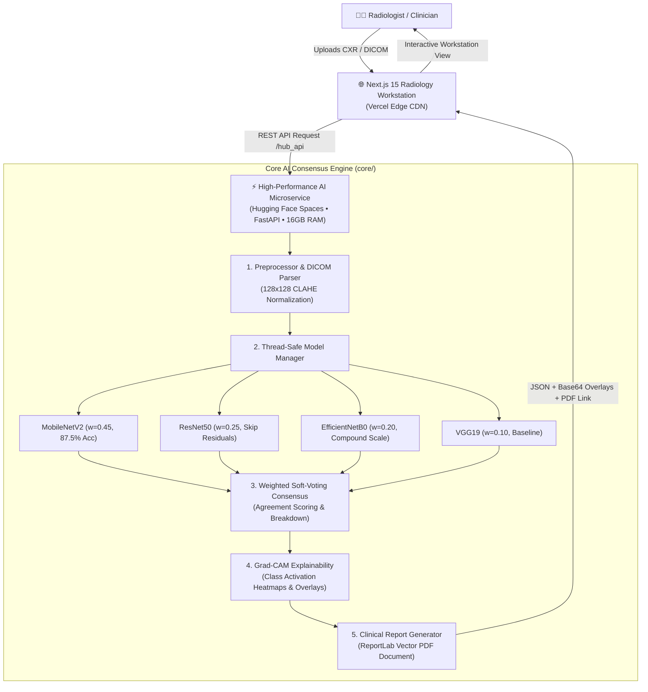

# 🫁 Pneumonia Diagnostic Hub • AI Radiology Workstation

[](https://pneumonia-diagnosis-app.streamlit.app/)
[-black?style=for-the-badge&logo=vercel)](https://pneumonia-dignosis-hub.vercel.app/)
[-46E3B7?style=for-the-badge&logo=render)](https://render.com)
[](https://huggingface.co/spaces/Shahabkhan396/pneumonia-hub)
[](https://python.org)
[](https://tensorflow.org)
[](tests/)
[](LICENSE)

---

> # ⚠️ **IMPORTANT ARCHITECTURAL EVOLUTION & DEPLOYMENT CHALLENGE**
>
> ### **1. INITIAL DEPLOYMENT ARCHITECTURE (DECOUPLED 3-TIER STACK):**
> * **Frontend Workstation:** Built with **Next.js 15 (App Router)** and deployed on **Vercel** ([pneumonia-dignosis-hub.vercel.app](https://pneumonia-dignosis-hub.vercel.app/)).
> * **Backend API Service:** Built with **FastAPI (Python ASGI)** and deployed on **Render**.
> * **Deep Learning Model Serving:** Hosted and served via **Hugging Face Spaces**.
>
> ### 🛑 **THE CRITICAL CLOUD INFRASTRUCTURE & DEPENDENCY PROBLEM:**
> # **Hugging Face discontinued free persistent CPU tiers for heavy multi-model execution, and when attempting to utilize Hugging Face ZeroGPU, severe dependency and CUDA ABI conflicts occurred between ZeroGPU’s PyTorch-native runtime and TensorFlow 2.16+ / Keras 3. Furthermore, Render’s free tier memory limit (512 MB) triggered severe Out-Of-Memory (OOM) crashes when attempting to host all 4 deep vision models (VGG19, ResNet50, EfficientNetB0, MobileNetV2).**
>
> ### 🚀 **THE PRODUCTION SOLUTION — UNIFIED STREAMLIT COMMUNITY CLOUD:**
> # **To solve these cloud memory ceilings, free-tier restrictions, and ZeroGPU/TensorFlow compatibility conflicts, I re-architected and unified the entire clinical workstation into a high-performance, single-tier deployment on Streamlit Community Cloud: 👉 [pneumonia-diagnosis-app.streamlit.app](https://pneumonia-diagnosis-app.streamlit.app/). This unified production app directly runs the 4-Model Consensus Engine, dynamic Grad-CAM XAI re-blending, DICOM 3.0 parsing, and publication-grade PDF report export with Git LFS model tracking and zero external API latency!**

---

An enterprise-grade, clinical-assisted decision support system for chest radiograph (CXR) pneumonia screening. Powered by a **4-Model Weighted Soft-Voting Consensus Engine**, **Explainable AI (Grad-CAM heatmaps)**, **DICOM (.dcm) metadata parsing**, and automated **Clinical PDF Report Generation**.

> **Medical Disclaimer:** This system is intended for research, demonstration, and clinical decision support purposes. It is not an FDA-cleared diagnostic device and should not replace professional radiological evaluation.

---

## 🏛️ System Architecture



---

## 📁 Clean Repository Structure

```text
├── app.py                     # Hugging Face Space & FastAPI ASGI Server Entrypoint
├── config.py                  # Unified Root Configuration (Paths, Model Weights, Specs)
├── core/                      # Core Machine Learning & Medical Imaging Engine
│   ├── __init__.py            # Package exports
│   ├── dicom_parser.py        # DICOM (.dcm) pixel decompression & metadata tags
│   ├── ensemble.py            # 4-Model weighted soft-voting consensus logic
│   ├── gradcam.py             # Gradient-weighted Class Activation Mapping (Grad-CAM)
│   ├── model_manager.py       # Thread-safe lazy model caching & inference manager
│   ├── preprocessor.py        # Radiograph CLAHE normalization & resizing (128x128)
│   ├── report_generator.py    # Publication-grade Clinical PDF Report generation
│   ├── sample_manager.py      # Synthetic radiograph study generator & catalog
│   └── validator.py           # Secure file validation & collision-free path generator
├── models/                    # Deep learning model weights (Tracked via Git LFS)
│   ├── mobilenet_model.h5     # MobileNetV2 (~11.5 MB)
│   ├── resnet50_model.h5      # ResNet50 (~101 MB)
│   ├── efficientnet_model.h5  # EfficientNetB0 (~20.8 MB)
│   └── VGG19_model.h5         # VGG19 (~443 MB)
├── frontend/                  # Modern Next.js 15 Medical Dashboard (Vercel-ready)
│   ├── app/                   # App Router UI & Serverless API Proxies
│   ├── components/            # Workstation components (DICOM Viewer, Grad-CAM slider)
│   └── package.json
├── static/                    # Generated output assets & sample studies
│   ├── samples/               # Pre-synthesized normal, bacterial & viral samples
│   └── uploads/               # Processed scans, heatmaps & clinical reports
├── tests/                     # 31 Comprehensive Pytest Unit & Integration Tests
│   ├── test_api.py            # API endpoint health, predict & comparison tests
│   ├── test_dicom.py          # DICOM header parsing & conversion tests
│   ├── test_docs.py           # OpenAPI / Swagger UI schema validation tests
│   ├── test_ensemble.py       # Consensus voting & weighting algorithm tests
│   ├── test_gradcam.py        # Grad-CAM heatmap & overlay blending tests
│   ├── test_model_manager.py  # ModelManager singleton & inference tests
│   ├── test_preprocessor.py   # Tensor scaling & image normalization tests
│   ├── test_report_generator.py# ReportLab PDF compilation tests
│   └── test_samples.py        # Synthetic sample radiograph generation tests
├── Dockerfile                 # Production container specification
├── docker-compose.yml         # Multi-container orchestration
└── requirements.txt           # Production Python dependencies
```

---

## 🚀 Quickstart & Local Setup

### 1. Clone & Environment Setup
```powershell
git clone https://github.com/Shahab-khan396/-Pneumonia-Diagnostic-Hub-AI-Radiology-Workstation-Multi-Model-Consensus-Engine-DICOM-Ready-.git
cd -Pneumonia-Diagnostic-Hub-AI-Radiology-Workstation-Multi-Model-Consensus-Engine-DICOM-Ready-

python -m venv .venv
.\.venv\Scripts\Activate.ps1
pip install -r requirements.txt
```

### 2. Launch the Streamlit AI Radiology Workstation
```powershell
streamlit run streamlit_app.py
```
Opens the interactive clinical decision support workstation with 4-Model Consensus, DICOM viewer, Grad-CAM attention blending, and PDF reporting at `http://localhost:8501`.
See [STREAMLIT_DEPLOYMENT.md](STREAMLIT_DEPLOYMENT.md) for 1-click **Streamlit Community Cloud** hosting!

### 3. Run the AI API Server (FastAPI / HF Space)
```powershell
uvicorn app:app --host 0.0.0.0 --port 7860 --reload
```
Interactive Swagger API documentation will be available at `http://localhost:7860/docs`.

### 4. Run the Next.js Frontend
```powershell
cd frontend
npm install
npm run dev
```
Open `http://localhost:3000` to access the modern radiology workstation.

### 5. Run the Full Test Suite
```powershell
pytest tests/ -v
```
All automated unit and integration tests execute in under 25 seconds.

---

## 📡 REST API Reference

| Method | Endpoint | Description |
| :--- | :--- | :--- |
| `GET` | `/hub_api/health` | Service health status & loaded model catalog |
| `GET` | `/hub_api/models` | Available model metadata, parameter counts & weights |
| `GET` | `/hub_api/samples`| Pre-packaged sample studies (Normal, Bacterial, Viral) |
| `POST` | `/hub_api/predict`| Single-model inference with Grad-CAM & PDF report |
| `POST` | `/hub_api/compare`| 4-Model consensus evaluation with agreement rating |
| `GET` | `/hub_api/reports/{filename}` | Download generated Clinical PDF Report |
| `GET` | `/docs` | Interactive Swagger UI API documentation |

---

## 📜 License
Released under the [MIT License](LICENSE).